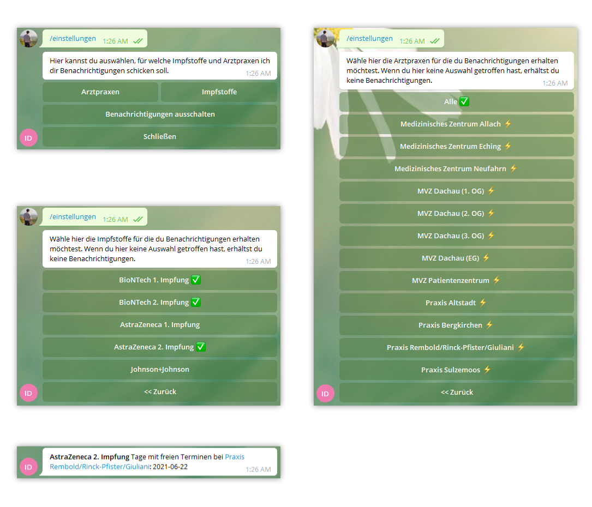

# [@dachau_impf_bot](https://t.me/dachau_impf_bot)

A Telegram bot to check the contents of https://termin.dachau-med.de for available slots and inform
users of the available dates. This is to avoid having to constantly check for available slots
manually.

The architecture allows that other portals for vaccination signup could be supported easily, but we
would probably need to add functionality to subscribe to a subset of available portals relevant for
the user instead of sending them any and all available slots as is the case right now.



## Deployment

```
$ git clone https://github.com/NiklasRosenstein/telegram-dachau_impf_bot.git
$ cd telegram-dachau_impf_bot
$ echo "token: TOKEN_HERE" >config.yml
$ docker-compose up -d
```

## Documentation

### Available Commands

```
einstellungen - Konfiguriere die Arztpraxen und Impfstoffe für die du Benachrichtigungen erhalten möchtest.
```

### Bot About (<=120 characters)

Sagt dir bescheid wenn im Landkreis Dachau und Umgebung Impftermine frei werden. Fragen, etc. an @NiklasRosenstein

### Bot Description

Der Bot sendet dir eine Nachricht, wenn bei https://termin.dachau-med.de/ Impftermine frei werden.

Fragen, Probleme oder Anregungen? Gerne an @NiklasRosenstein. Du kannst den Quellcode dieses Telegram Bots auf GitHub finden: https://github.com/NiklasRosenstein/telegram-dachau_impf_bot

## Changelog

*Neu in Version 1.0.0*

Um weiter Benachrichtigungen zu erhalten, musst du jetzt in deinen Einstellungen angeben, für
welche Arztpraxen und Impfstoffe du dich interessierst. Sende dazu /einstellungen und folge einfach
der Benutzeroberfläche. Du erhältst von jetzt an keine neuen Benachrichtigungen, bis du diese
Einstellungen vorgenommen hast.

---

<p align="center">Copyright &copy; 2021 Niklas Rosenstein</p>
